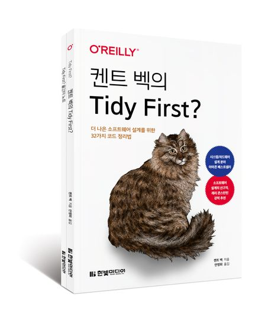

# tidy-first

> 『켄트 벡의 Tidy First?』를 읽고 정리하는 저장소입니다.   This is a repository for reading, studying, and organizing “Tidy First” by Kent Beck.

## 목차

- [Part 1 코드 정리법](document/part1/README.md)
    - Chapter 1. 보호 구문
    - Chapter 2. 안 쓰는 코드
    - Chapter 3. 대칭으로 맞추기
    - Chapter 4. 새로운 인터페이스로 기존 루틴 부르기
    - Chapter 5. 읽는 순서
    - Chapter 6. 응집도를 높이는 배치
    - Chapter 7. 선언과 초기화를 함께 옮기기
    - Chapter 8. 설명하는 변수
    - Chapter 9. 설명하는 상수
    - Chapter 10. 명시적인 매개변수
    - Chapter 11. 비슷한 코드끼리
    - Chapter 12. 도우미 추출
    - Chapter 13. 하나의 더미
    - Chapter 14. 설명하는 주석
    - Chapter 15. 불필요한 주석 지우기

- [Part 2 관리](document/part2/README.md)
    - Chapter 16. 코드 정리 구분
    - Chapter 17. 연쇄적인 정리
    - Chapter 18. 코드 정리의 일괄 처리량
    - Chapter 19. 리듬
    - Chapter 20. 얽힘 풀기
    - Chapter 21. 코드 정리 시점

- [Part 3 이론](document/part3/README.md)
    - Chapter 22. 요소들을 유익하게 관계 맺는 일
    - Chapter 23. 구조와 동작
    - Chapter 24. 경제 이론: 시간 가치와 선택 가능성
    - Chapter 25. 오늘의 1달러가 내일의 1달러보다 크다
    - Chapter 26. 옵션
    - Chapter 27. 옵션과 현금흐름 비교
    - Chapter 28. 되돌릴 수 있는 구조 변경
    - Chapter 29. 결합도
    - Chapter 30. 콘스탄틴의 등가성
    - Chapter 31. 결합도와 결합도 제거
    - Chapter 32. 응집도
    - Chapter 33. 결론

---

**잘못된 내용이 있거나 개선이 필요하다면 [이슈](https://github.com/woookk/tidy-first/issues)로 제보해주세요.**
